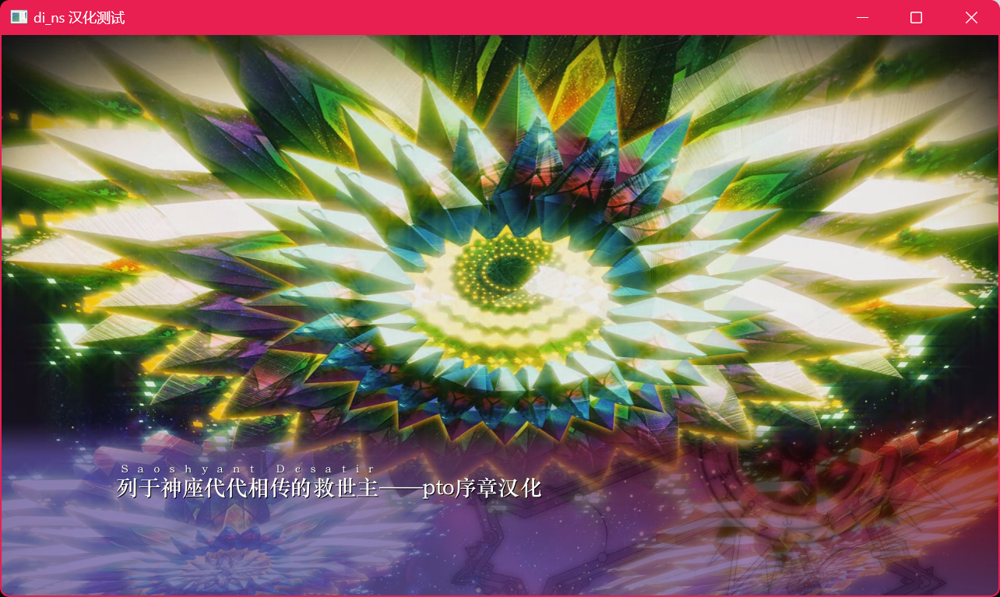

# di_pto Script Tool

可导出和导入 Maliesystem 引擎剧本的脚本，仅适用于游戏 **Dies irae \~~Amantes Amentes~~ Switch 版**

用于pto序章——**神なる座に列し伝わる救世主 (サオシュヤント・デサーティール)** 汉化。

---

A tool for export and export script files from the Maliesystem engine, specifically designed for the **Dies irae \~~Amantes Amentes~~ Nintendo Switch version**.

Mainly used for Chinese localization of Phanteon prologue -- **The Savior listed in the seat of God (Saoshyant-desatir)**.

